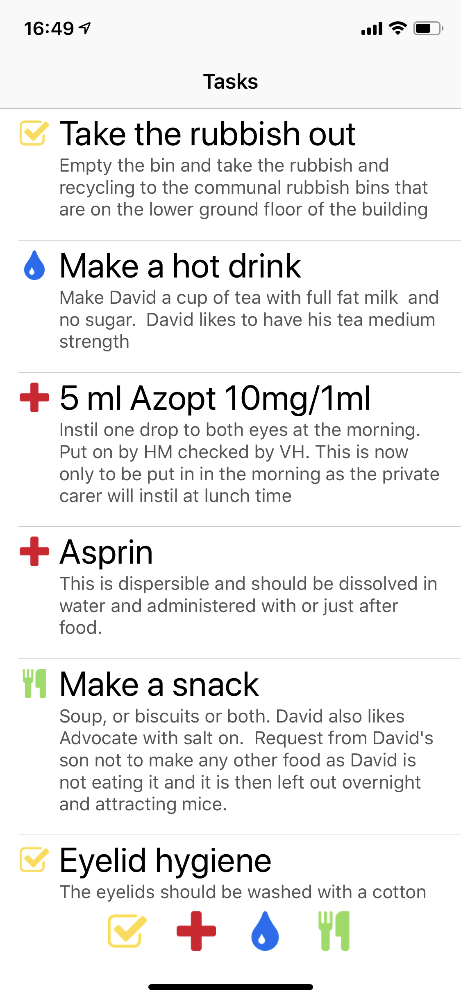

# Android Technical Challenge

This package includes a basic UI design image and a set of icons. The url below will provide a set of care tasks. The tasks in the json come in four types
- General
- Medication
- Hydration
- Nutrition

## Your challenge is as follows:
1. Create an android app to display the tasks as shown in 'design.png'.

1. Please use clean & MVVM architecture and design the app to be extensible.
1. Use the following endpoint to get your data
`https://adam-deleteme.s3.amazonaws.com/tasks.json`
1. Include a database of your choice to create an offline first UX.
1. Make it possible for the user to filter the task list using the buttons at the bottom of the screen. It should be possible to apply multiple filters at once and to toggle each filter on or off.
1. When the device goes offline, show a banner at the top of the screen to warn the user.
1. Demonstrate and create unit tests as necessary (we are not after full coverage here, but how to approach testing).
1. Demonstrate and create espresso test(s) to cover the list and the offline banner.

Feel free to create any additional classes/files you think are needed.
